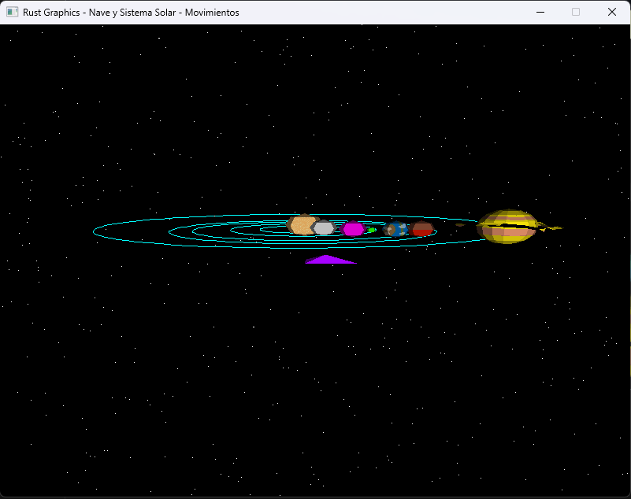

# Proyecto 3 - GraficasXComputadoras (Space Travel)

**Proyecto Final: Space Travel**

``git clone https://github.com/BrandonReyes0609/Proyecto3-GraficasXComputadoras.git``

``cd Proyecto3-GraficasXComputadoras``

## Códigos ejecutar

``cargo run``

``cargo build --release``

``./target/release/codigo``

## Manejo de la nave

Controles:

Teclado

* **`W`** : Mover hacia adelante, reduciendo la posición en el eje `Z`.
* **`S`** : Mover hacia atrás, aumentando la posición en el eje `Z`.
* **`A`** : Mover hacia la izquierda, reduciendo la posición en el eje `X`.
* **`D`** : Mover hacia la derecha, aumentando la posición en el eje `X`.
* **`ESPACIO`** : Dispara rayos laser la nave espacial.

Controles:

* Girar scrol hacia adelante: Acercar zoom.
* Girar scrol hacia atras: Alejar zoom.
* preciona scrol y mover mouse: gira la nave.

Video Youtrube

* [https://youtu.be/pGrqUPz90K4](https://youtu.be/pGrqUPz90K4 "https://youtu.be/pGrqUPz90K4")

